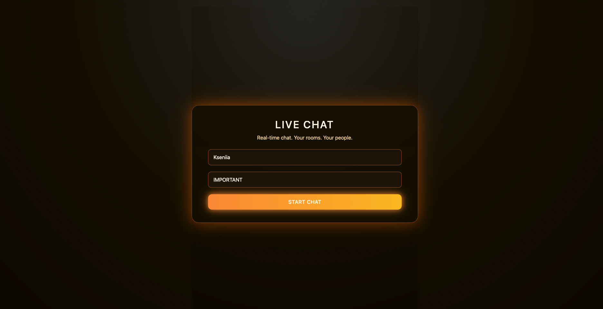
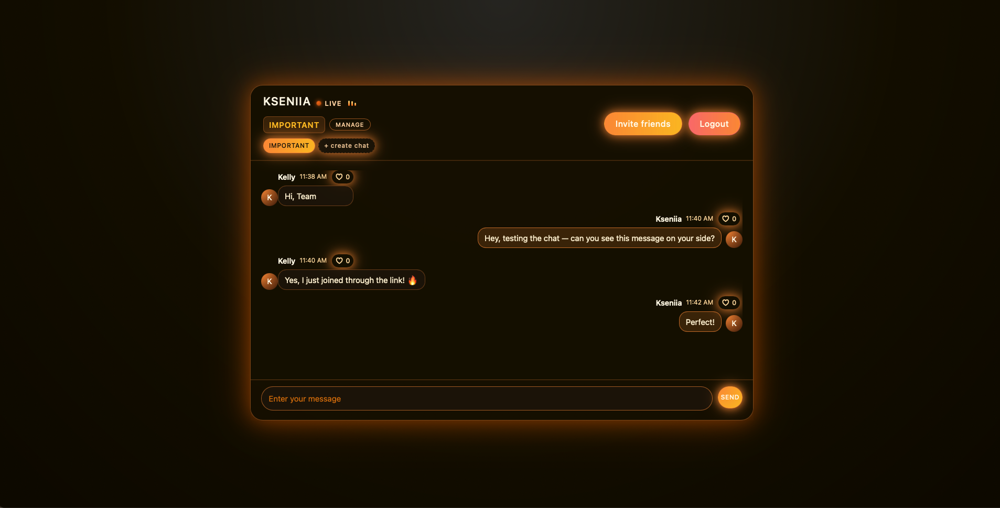
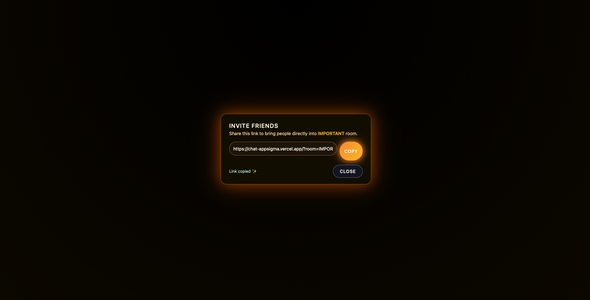
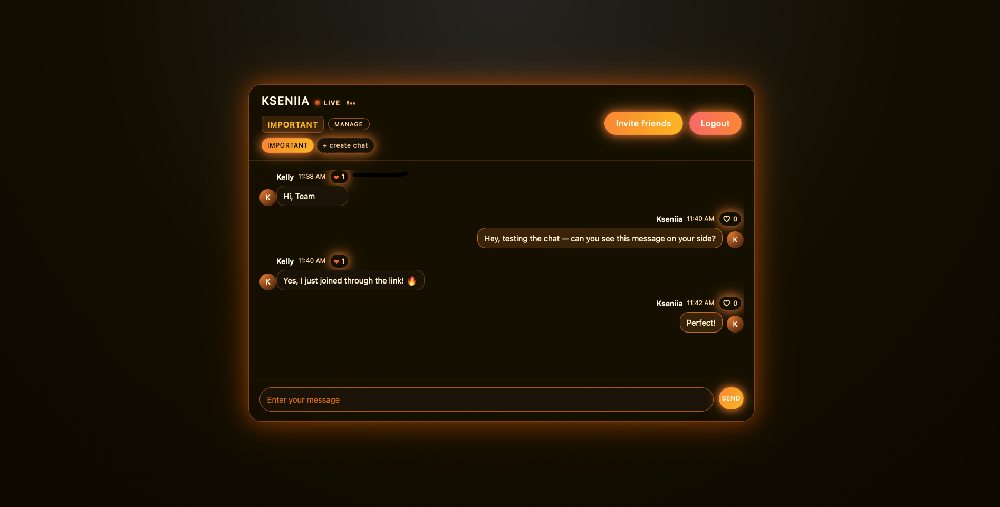

# Real-Time Chat Application

## Overview
A modern **real-time chat platform** built with **Flask-SocketIO** (backend) and **React + TypeScript** (frontend).  
Supports instant messaging, custom rooms, reactions, and a polished animated UI.

## Features

- **Welcome Screen**: Enter your name, choose or create a room, and instantly join the chat.

- **Real-Time Messaging**: Messages appear instantly for all users in the room through WebSockets.

- **Multi-Room System**: Create unlimited rooms, switch between them, rename, or delete rooms locally.

- **Invite Friends**: Generate a personal invite link — users join your room automatically.

- **Message Reactions**: Like any message — likes update instantly for all connected users.

## Technologies Used

- **React + TypeScript**
- **Vite**
- **Socket.IO Client**
- **Flask + Flask-SocketIO**
- **Python 3**
- **LocalStorage**
- **Custom CSS (Glow Theme)**
- **Clipboard API**

Feel free to reach out if you have any questions or suggestions.

